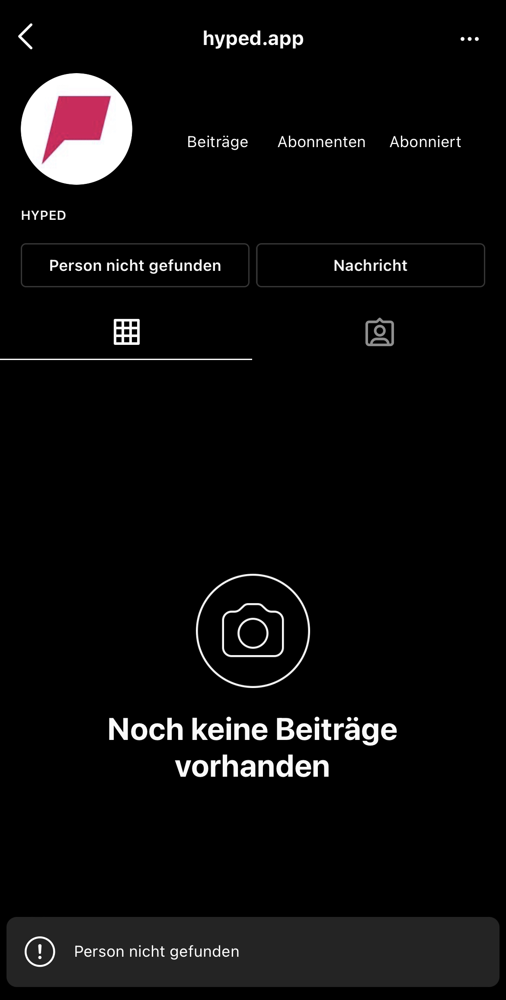

# Hyped-App: Die wohl komischste 100.000 Euro App
<!-- date: 2021-09-03 14:00:00 -->
<!-- category: security -->
<!-- description: Eine kleine Analyse meinerseits über die Hyped App von Trymacs, Rewinside und UnsypmatischTV. -->
```
Der Beitrag ist schon was älter, deswegen können gewissen Informationen veraltet sein.   
Insgesamt hat sich die ganze Thematik zwischen dem 11.7.2021 und dem 18.7.2021 abgespielt.  
Dieser Beitrag ist auch kein normaler Security Blog Artikel.
```

# Hyped-App - Wo fange ich da an?

Diese Frage ist meiner Meinung nach sehr berechtigt zu stellen, da es bei dieser App einiges an Kritik gibt und damit meine ich gar nicht nur den Teil der Informatik.

Also fangen wir mal mit den Grundlagen an: Am 10\. Juli 2021 haben Rewinside, Trymacs und UnsympatischTV ihre App namens Hyped veröffentlicht. ([Quelle](https://www.instagram.com/p/CQybMQoByQn/)) Diese App besteht kurz gesagt daraus Beichten zu schreiben und diese in drei Kategorien zu bewerten: "Downvote", "Upvote" und "Hype" (Mittlerweile heißen diese "Okay", "Trash" und "Hyped"). Bis dato, alles schön und gut. Man könnte jetzt hier schon Anfangen, die App zu kritisieren, dass es schon unzählige Apps dieser Art gibt oder dass es das Konzept dieser App quasi schon als [Open Source Version auf GitHub](https://github.com/kuuhaku0/Hype-Post-App) gibt, aber das will ich einfach mal außen vor lassen, denn es könnte immer sein, das neue Apps mit neuen Ideen den Markt überraschen wollen. Auch wenn das meiner Meinung nach nicht gegeben ist. Den die Punkte, die angebracht werden, warum diese App so einzigartig ist, sind: deren Voting System und deren dazugehöriges XP-System. Und da sind wir auch schon beim nächsten Punkt angekommen,

### das XP-System.

Das XP-System, ein System wie kein anderes. Es ist sehr einfach, man muss in der App Beichten bewerten und wen man genauso wie der Rest der Community bewertet hat, dann kriegt man die meisten XP-Punkte und Coins. Und wen man gewisse XP-Stände überschreitet, kriegt man ein gewisses Level, was aber natürlich von Level zu Level schwieriger wird. Und so wie die Community ist, will jeder das höchste Level und die meisten Punkte, es hat sich also etabliert, dass jeder Upvote drückt. Bei jeder Beichte haben nun 95% immer mit Upvote gestimmt. Damit kriegt jeder die meisten Punkte, also ist eigentlich das komplette Konzept der App kaputt. So lassen mittlerweile viele ihre Autoklicker durchlaufen um im Level zu steigen, was zum jetzigen Zeitpunkt noch nichts bringt. Man muss dazu sagen, dass es mittlerweile dieses Problem nicht mehr gibt, da eigentlich alle Leute genau so wie ich von dieser App losgelassen haben. Wir die Idioten sind raus. Auf beide Sätze komme ich gleich nochmals zurück.

So okay, schön und gut, denkt man sich jetzt. Eine App ist gescheitert und funktioniert nicht, ist ja nichts Besonderes. Wären da nicht noch zwei weitere Punkte.

## IT-Security

Diesen Abschnitt können wir eigentlich auch ganz schnell abarbeiten, die API hat kein Rate-Limit, das Swagger-File ist öffentlich, das Backend ist in Spring Boot und nach ein paar zu vielen Anfragen geht deren Backend down, ohne dass man es wollte.

Hier einmal ein paar Infos zu Leveln:

1.  Man kann innerhalb von Sekunden Level 100 erreichen.
2.  Man kann innerhalb von Minuten Level 500 erreichen.
3.  Mein Maximalstand war Level 200, XP ca. 5 Millionen und Coins bei ungefähr 10 Millionen nach einer Nacht.

Ein paar Probleme die ich bei diesen hohen Leveln hatte: Da die App ganz neu war, es gab zu dem Zeitpunkt wo ich angefangen habe ungefähr 100k Beichten. (Jede Beichte kann man nur einmal bewerten.) Diese hatte ich aber innerhalb von einer Stunde abgearbeitet, also geliked. Es mussten also neue Beichten her: So habe ich ein zweites Script geschrieben, welches Beichten schreibt. (Der übrigens Werbung für unsern Discord Server gemacht hat, ich habe deswegen viele witzige Gespräche in der Nacht vom 11 auf den 12 Juli geführt.)

So, zu noch mehr lustigen Zahlen: 2 Millionen Beichten haben wir in einer Nacht gepostet, weshalb man hat eigentlich nichts anderes außer unsere Beichten zusehen bekommen.

Am Ende hat Garkolym noch das Admin Interface gefunden ([Quelle](https://twitter.com/garkolym/status/1416378060253896708)).

Ohne Rate Limit ist natürlich auch das Spamming von ihren Mail Servern möglich. 

#### Nun aber mal zu dem Punkt: Wieso? Wieso habt ihr diese Fehler nicht gemeldet? Wieso habt ihr es nicht einfach gelassen?

Ich haben diese Fehler gemeldet, haben jedoch auf unsere E-Mails nie Antworten bekommen (bis heute den 3.9.2021 nicht) und auf Instagram wurden ich nach Anfragen blockiert. Danach habe ich mich entschieden auf eine andere Weise zu kommunizieren (Haben es übrigens auch über Unterschiedliche Discord Server probiert.).

<p></p>


#### Wie wurden die Fehler nun behoben?

Gar nicht! Es wurde zwar eingebaut, dass man nur noch 10 Beichten am Tag posten kann, aber auch nicht mehr. Den Punkt mit dem Rate Limit, der wurde nicht behoben. Man kann immer noch innerhalb von Minuten allen Leuten folgen und alle Beichten liken.

## Ich würde diesen Teil gerne "Uneinsichtig und Inkompetent" nennen.

Ich habe lange Diskussionen mit psychologisch gebildeten Leuten über diesen Abschnitt gesprochen. Und bin deswegen zum Entschluss gekommen, den Part jetzt genau so zu schreiben, wie ich ihn geschrieben haben werde.

Ich würde eigentlich gerne noch etwas tiefer auf meine Persönliche Analyse von Trymacs Persönlichkeit eingehen, denke aber das es eher meine persönliche Analyse bleiben sollte.

Dann mal zu den Fakten zurück: Es wurde keine Einsicht gezeigt. Ich finde das sehr schwierig in Worte zu fassen, aber die App wurde als ein Meisterwerk präsentiert, als hohe Kunst der Informatik. Und das 6 Entwickler für 6 Monate für 100k Euro daran gearbeitet hätten und das Beste gemacht hätten. Bei diesen Summen hätte wohl auch jeder zugeschlagen. Die App ist das einfachste was es gibt. Ich glaube wenn ich Leuten auf Twitter einen Monat Zeit geben würde und diesen dafür 10k Euro geben würde, wäre etwas Besseres rausgekommen. Aber nochmals zu dem Punkt: keine Einsicht. Es heißt bei Trymacs immer, die anderen sind schuld. Wir machen keine Fehler nur die anderen. Das hat sich durch das ganze Thema durchgezogen. In dem Kontext ist übrigens auch der Satz mit dem "Idioten" gefallen den ich oben angesprochen hatte. 

Auch noch ein lustiges Thema: Ich glaube bis heute, dass ihnen nicht bewusst ist, dass ich direkt ans Backend gegangen bin und nicht die App benutzt habe. So hat sich das angehört und angefühlt. Den Rate Limits gibt es bis auf das Beichten Limit eigentlich nur im Frontend. 

Ich würde das ganze Kritikunfähig nennen.

Übrigens die zwei anderen Gründer der App: Rewinside und UnsympathischTV haben sich zu der ganzen Thematik sehr zurückgehalten.

## Noch ein paar Rand Bemerkungen

Klengan hat uns Lustig in seinem [Video](https://www.youtube.com/watch?v=QiXGx4b2lTg) erwähnt. "Ob das ein Bot ist?"

Nach dem [Garkolym](https://twitter.com/garkolym) darübergeschrieben hat, hat sich eine kleine Community um ihn aufgebaut, die sich gefühlt halt, als wären sie die besten. Ich finde das bei einem solchen Thema Austausch immer wichtig ist, aber dieser war bei Leuten wie z.b. Shortbyte nicht gegeben. Ich finde es schade, nach einer kleinen Diskussion mit ihm darüber, blockiert worden zu sein.

Die App ist insgesamt nicht gut angekommen, da sie keinen Inhalt besitzt. Und dies wurde auch von der deutschen YouTube-Szene so wahrgenommen, weswegen ein paar Kritikvideos entstanden sind, welche jedoch von TryMacs meist mit: "Also in meiner Freundes Gruppe ist es gut angekommen" beantwortet wurden.

Nun ist die App tot, ich habe zwar keine genauen Zahlen, aber alles was ich erfahren habe ist, dass die App fast keiner mehr wirklich benutzt.

Es soll übrigens in ferner Zukunft ein Update kommen was die App tausendmal besser machen soll. Ob das stimmt, wage ich zu bezweifeln.

Wen man gebannt wird, wird das immer händisch gemacht und wohl auch immer von anderen Personen. Habe die unterschiedlichsten Banngründe bekommen.

<p></p>

Und noch ein kurzer Exkurs zu den AGB der App. Alle Mitglieder müssen 18 sein. Ich bin ehrlich, das ist bei der Community schwierig (§ 2.1). Und was bei einer Beichten-App auch schwierig ist: Die Nutzer sind verpflichtet, bei der Registrierung ihren Klarnamen anzugeben und auf Pseudonyme zu verzichten. Also anonyme Beichten mit Klarnamen, das ist mal was ganz Neues. Also wenigstens doch eine neue Erfindung in der App.  

## Das Ende

Falls du bis hier gelesen hast, wollte ich dir danken. Wenn du Verbesserungsvorschläge hast oder Fehler gefunden hast, schreib mir gerne auf [Twitter](https://twitter.com/Newspicel) oder auf [Discord](https://discord.newspicel.dev). Und es tut mir leid, dass dieser Beitrag so lange gebraucht hat.

Und damit Tschüss.

Kleiner Anhang: Danke an die Grammatik- und Rechtschreibungs-Überarbeitung von [Elektroniker](https://twitter.com/Elektroniker).